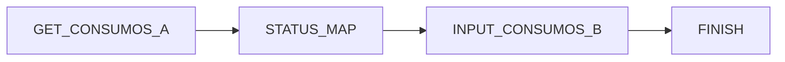

# Desafio Técnico Systock

## Versões das Ferramentas:

- **Pentaho Data Integration:** 9.4.0
- **PostgresSQL:** 16
- **Docker:** 27.1.0
- **Ubuntu:** 22.04.4 LTS

## Ambiente:

O banco de dados Postgres está em Docker e o Pentaho Data Integration (PDI) está em uma máquina Windows.

### Configuração do Docker:

- **Container:** database-postgres

### Configuração do Windows:

- **Aplicativo:** Pentaho DI

## Solução do Desafio:

Abaixo está o fluxo de trabalho utilizado para a solução do desafio, representado em diagrama Mermaid:

## Detalhes das Etapas da Solução:

### GET_CONSUMOS_A

**Descrição:**

Leitura da tabela que será migrada para outra banco de dados onde, aqui configuraremos a parte de tabelas  que serão puxadas de banco de dados.

**Imagem:**

### STATUS_MAP

**Descrição:**

Essa etapa irá filtrar coluna status de acordo com o valores configurados para os predefinidos como na Target Values

**Imagem:**

### INPUT_CONSUMOS_B

**Descrição:**

Nessa etapa será inserido no banco de dados de destino os dados já tratados pelas etapas anteriores (STATUS_MAP),

**Imagem:**

### FINISH

**Descrição:**

Etapa para informa se todo o processo foi feito com sucesso

**Imagem:**

Neste fluxo, o processo começa com **GET_CONSUMOS_A**, passa por **STATUS_MAP** e **INPUT_CONSUMOS_B**, e finaliza em **FINISH**.